# Installing Foxglove

This installation assumes you have a Raspberry Pi flashed with Ubuntu 20.04 and ROS Noetic installed.

## Prerequisites

- Raspberry Pi model: 4B
- Image used: [ubuntu-20.04.5-preinstalled-server-arm64+raspi.img.xz](https://cdimage.ubuntu.com/releases/focal/release/)
- ROS used: [ros-noetic-desktop-full](https://wiki.ros.org/noetic/Installation/Ubuntu)
- Note: This guide targets ROS 1 Noetic.

## Table of Contents

- [Installing Foxglove](#installing-foxglove)
  - [Prerequisites](#prerequisites)
  - [Table of Contents](#table-of-contents)
  - [Step 1: Have ROS running in the background](#step-1-have-ros-running-in-the-background)
    - [Check whether ROS is running](#check-whether-ros-is-running)
    - [Option A: Manual](#option-a-manual)
    - [Option B: Auto on startup](#option-b-auto-on-startup)
  - [Step 2: Set up the Foxglove ROS bridge](#step-2-set-up-the-foxglove-ros-bridge)
  - [Step 3: Connect to Foxglove from your computer](#step-3-connect-to-foxglove-from-your-computer)
  - [Step 4: Examples](#step-4-examples)
    - [Example 1: Viewing a topic](#example-1-viewing-a-topic)
    - [Example 2: Publish a topic](#example-2-publish-a-topic)
    - [More helpful panels](#more-helpful-panels)
    - [Fun example](#fun-example)

## Step 1: Have ROS running in the background

### Check whether ROS is running

- On the Raspberry Pi 4, open a new terminal and type `rostopic list`.
- If it does not throw an error and shows topics, ROS is already running and you can skip this step.

### Option A: Manual

Open a new terminal and run `roscore`.
This option is easy, but you must redo it on every startup.

### Option B: Auto on startup

- Open a terminal and create a systemd service (a Linux service that runs a program on boot in the background):

- Create and open `roscore.service`:

```bash
sudo nano /etc/systemd/system/roscore.service
```

- Copy and paste this configuration:

```ini
# Describe the service
[Unit]
# Short description of the service
Description=Bringup ROS Noetic
# Service will start after the network is up
After=network-online.target

# Configuration for the service
[Service]
# A simple service that runs roscore
Type=simple
# What user the service should run as (defaults to ubuntu)
User=ubuntu
# The command to run ROS
ExecStart=/bin/bash -lc 'source /opt/ros/noetic/setup.bash && exec roscore'
# Restart if it fails to run ROS
Restart=on-failure
# Restart if failed every 2 sec forever
RestartSec=2

# How the service is controlled
[Install]
# Can be enabled/disabled with command `sudo systemctl enable/disable <service>`
WantedBy=multi-user.target
```

- Reload systemd:

```bash
sudo systemctl daemon-reload
```

- Enable the service on startup:

```bash
sudo systemctl enable --now roscore.service
```

- View the service status:

```bash
systemctl status roscore.service --no-pager
```

It should show `Active: active (running)` in green. Otherwise, retry the steps above.

## Step 2: Set up the Foxglove ROS bridge

- Install the bridge:

```bash
sudo apt install ros-noetic-foxglove-bridge -y
```

- Create a systemd service (see Option B in Step 1 for a refresher)

- Create and open a service file:

```bash
sudo nano /etc/systemd/system/foxglove-bridge.service
```

- Paste this content:

```ini
[Unit]
Description=Foxglove Bridge (ROS Noetic)
After=network-online.target
Wants=network-online.target

[Service]
Type=simple
User=ubuntu
Environment=HOME=/home/ubuntu

ExecStart=/bin/bash -lc 'source /opt/ros/noetic/setup.bash && if [ -f "$HOME/catkin_ws/devel/setup.bash" ]; then source "$HOME/catkin_ws/devel/setup.bash"; fi && exec roslaunch foxglove_bridge foxglove_bridge.launch'

Restart=on-failure
RestartSec=2

[Install]
WantedBy=multi-user.target
```

- Reload and enable the service:

```bash
# Reload systemd
sudo systemctl daemon-reload

# Enable the service on startup
sudo systemctl enable --now foxglove-bridge.service

# View the service status
systemctl status foxglove-bridge.service --no-pager
```

- It should show `Active: active (running)` in green.
- If something goes wrong later (e.g., connection failure or WebSocket unreachable), restart the service with:

```bash
sudo systemctl restart --now foxglove-bridge.service
```

## Step 3: Connect to Foxglove from your computer

Foxglove runs a WebSocket server that streams your ROS environment, including nodes, topics, messages, and services.

- First, on the Raspberry Pi 4, type `hostname -I` and note the IP address.
- Next, on your computer, open a web browser (Chrome recommended) and go to [Foxglove Observability](https://app.foxglove.dev/signin).
- You can sign in with your Google or Microsoft account. If you don't have one, you can sign up with your email by click on "Sign up here" button and follow their instruction.
- After you sign in, the browser may show a "WebSocket SSL Error" warning about unsafe scripts. This is normal because it is connecting to a local WebSocket. Click the crossed-triangle icon at the top right and select "Load unsafe scripts."

    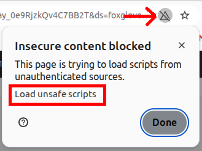

- The page will refresh and show the dashboard. Click the "Open connection..." button to open the connection window.

    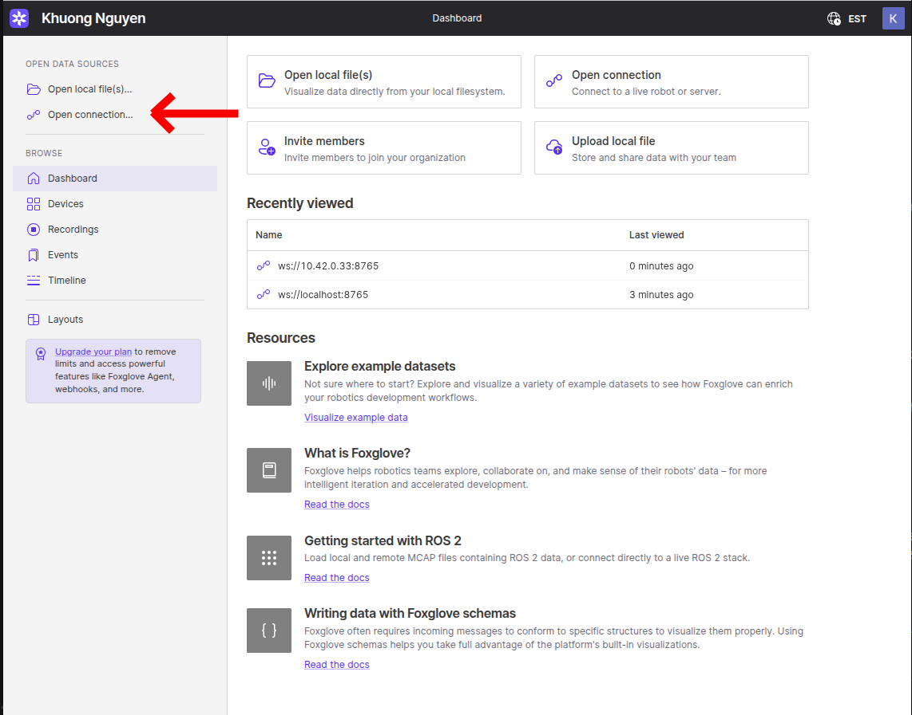

- In the WebSocket URL box, replace only `localhost` with your Raspberry Pi's IP address. For example: `ws://10.42.0.33:8765`. Then click `Open` to connect to ROS on the Raspberry Pi. If the connection is successful, the WebSocket URL will appear at the top without errors.

    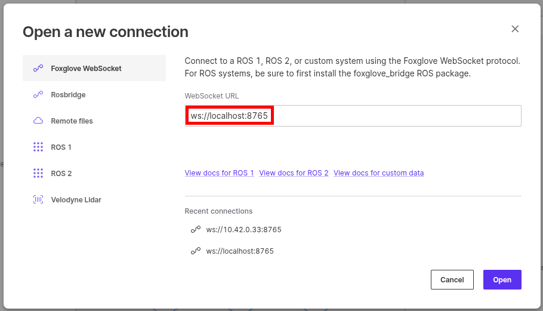

    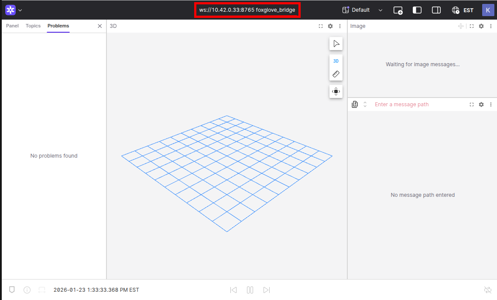

- You will see the UI. By default, it loads a left sidebar, a 3D view panel in the middle, and some panels on the right.

    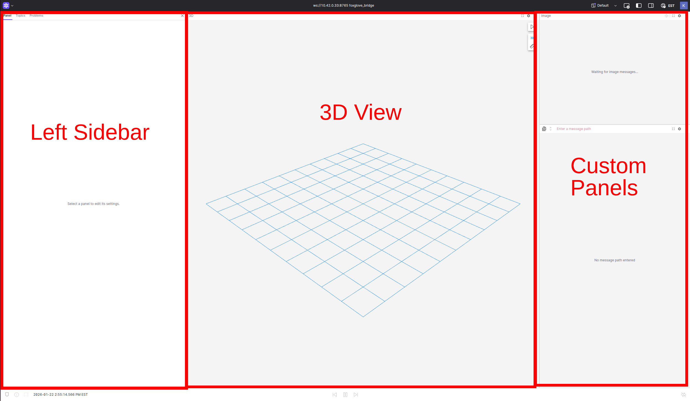

- The left sidebar has three main tabs at the top:

  **Panel**: shows the properties of a selected panel. A panel can be selected by clicking inside it.

  **Topics**: shows all available topics, including subscribed and published topics. It should match the output of `rostopic list` command.

  **Problems**: shows any errors.

    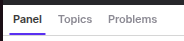

- The 3D view panel displays markers, camera images, 3D meshes, 3D scenes, point clouds, etc., that are published by topics.
- There are some additional panels on the right, but they are not important for now.
- You can close panels by clicking  on the top right of each panel, then click .

## Step 4: Examples

> Time for examples: less terminal wizardry, more point‑and‑click magic.

### Example 1: Viewing a topic

- In the left sidebar, open the "Topics" tab. This tab lists all available topics, the same as the topic list command.
- On the Raspberry Pi, run the command below and compare the topics listed in the terminal and inside Foxglove. They should match exactly.

```bash
rostopic list
```

- For each topic, the message type is shown below the topic name. If you click the arrow on the left of a topic, it expands and shows the message structure. It is convenient that it shows C-style fields, for example `.header.stamp`, so you can easily reference them when coding.

    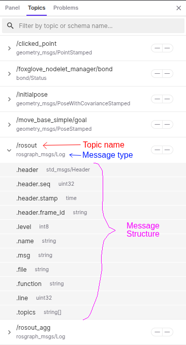

- Next, assume you have created `catkin_ws` and downloaded and built ros-keyboard from GitHub. Then, run the keyboard node in a new terminal:

```bash
source ~/catkin_ws/devel/setup.bash
rosrun keyboard keyboard
```

- Switch to the Foxglove window. You will see `/keyboard/keydown` and `/keyboard/keyup` topics in the "Topics" tab. If you see "empty schema" errors in the "Problems" tab, it means your workspace is not built or not sourced. If you have built it but the errors remain, restart the Foxglove bridge service by typing `sudo systemctl restart --now foxglove-bridge.service` in a new terminal.

    

- Let's see some live messages! At the top right of the Foxglove window, click "Add panel", search for, and open the "Raw Message" panel.

    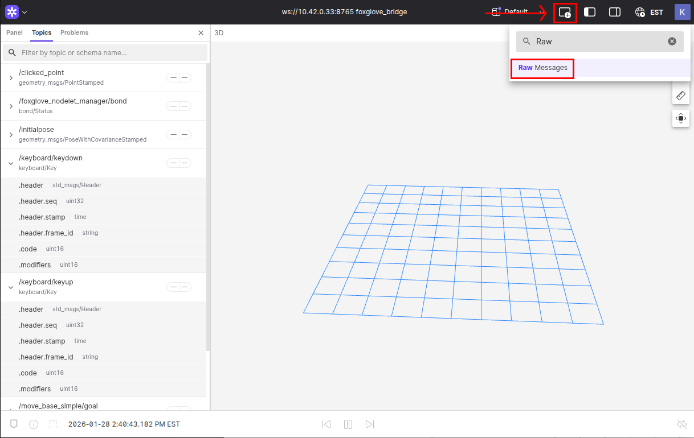

- The Raw Message panel will pop up. Then click the search box and select `/keyboard/keyup` or `/keyboard/keydown` from the dropdown, or enter the topic name in the search bar. The panel will show "Waiting for next message..." in the middle.

    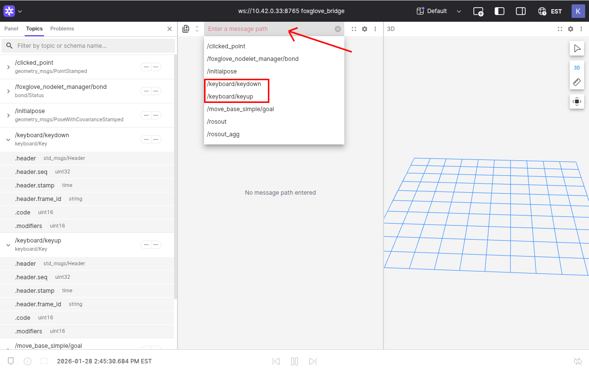

- Next, go to your keyboard window on the Raspberry Pi and type some random keys. Check the Raw Message panel as you type. You will see real-time data.
- This tool helps you view topics, inspect message structures, and track real-time data.

### Example 2: Publish a topic

For this example, we will use a simple ROS subscriber from the beginner_tutorials repository on GitHub.

- On your Raspberry Pi, download and build the beginner_tutorials repository into your `catkin_ws`:

```bash
cd ~/catkin_ws/src/
git clone -b Week10_HW --single-branch https://github.com/senthilarul/beginner_tutorials.git
cd ..
catkin_make
source devel/setup.bash
```

- Then run the listener node:

```bash
rosrun beginner_tutorials listener
```

- In the "Topics" tab in the Foxglove window, you should see the `/chatter` topic with the `std_msgs/String` message type, which is the topic the `listener` node is listening to.

    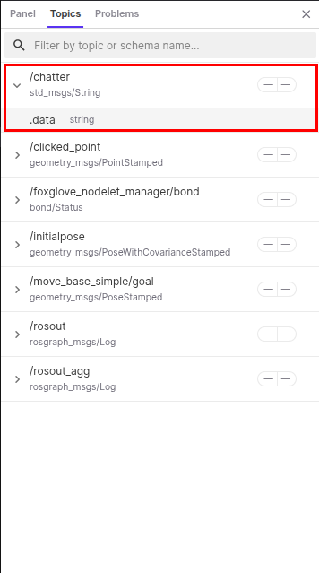

- You can open `/chatter` in the Raw Message panel to see the live data if you want.
- Now click "Add panel" and add a "Publish" panel. Then, in the left sidebar, switch to the "Panel" tab. There should be a title called "Publish" in the "Panel" tab. If you don't see it, click anywhere inside the Publish panel. Under the "General" section, click the "Topic" box and select `/chatter`, which is the topic we want to publish to.

    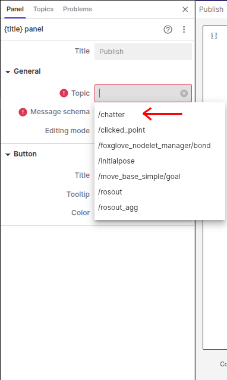

- Once you select the topic, the Publish panel will show the message structure in JSON format. JSON is a simple key/value format: keys are field names, and values can be strings (in quotes), numbers, booleans (`true`/`false`), arrays (`[ ]`), or nested objects (`{ }`). For this example, there is only one `data` field.

    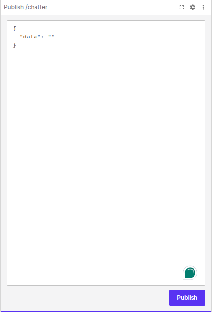

- Change the value of the `data` field to any string you want, for example "I love Mechatronic", then hit the "Publish" button at the bottom right. You will see your message in the terminal running the listener node on the Raspberry Pi, as well as in the Raw Message panel if you have `/chatter` open.

    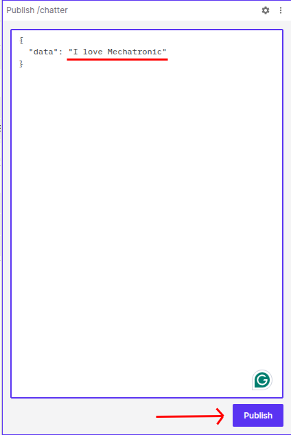

- You can publish a different message, for example "I love JEM 455", and try again.
- This tool helps you debug and test your custom nodes.

### More helpful panels

- **Topic Graph** visualizes the relationships between nodes, topics, and services:

    This is an example of having a `listener` node running and subscribed to the `/chatter` topic. Note the arrow directions. There are additional topics `foxglove_nodelet_manager` and `foxglove_bridge` that are managed by Foxglove; you can ignore them. There is also the `rosout` node subscribed to `/rosout`, which logs info, warning, and error messages from other nodes. There are some services (red rectangles) that you may not need to worry about, but they are there.

  - Nodes – blue rectangles
  - Topics – purple diamonds
  - Services – red rectangles

    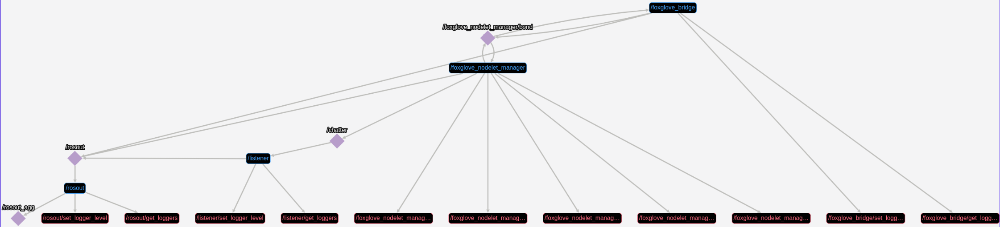

- **Transform tree** visualizes the hierarchical relationship of your coordinate frames. It's helpful if you want to see relationships between poses.

    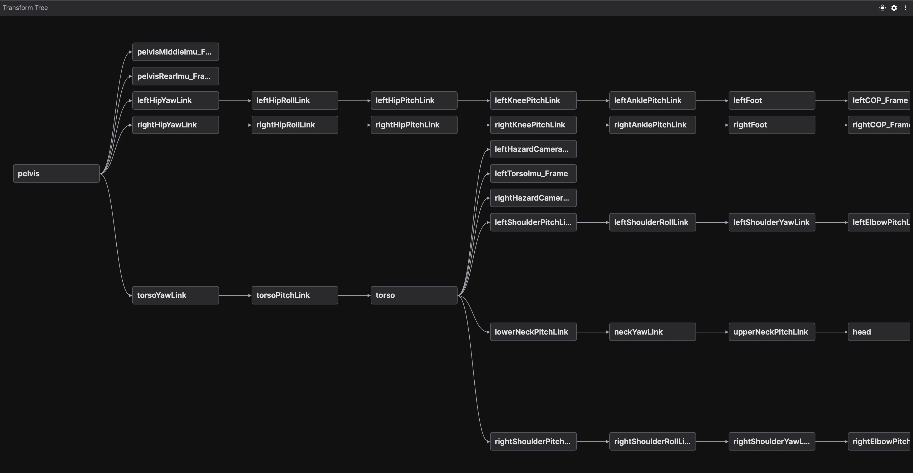

- **Teleop** lets you teleoperate your robot by publishing `geometry_msgs/Twist` messages on a given topic. For more info, refer to this [doc link](https://docs.foxglove.dev/docs/visualization/panels/teleop).

### Fun example

In this example, we will use **Teleop** to control a turtle in a simulation. The turtle behaves like a differential wheel robot, so it's good practice for learning differential-drive control.

- First, install the `turtlesim` package on your Raspberry Pi. Open a terminal and enter:

```bash
sudo apt-get install ros-$(rosversion -d)-turtlesim
```

- Then run the turtlesim node:

```bash
rosrun turtlesim turtlesim_node
```

- You'll see a turtlesim window with a turtle in the middle in a random color.

    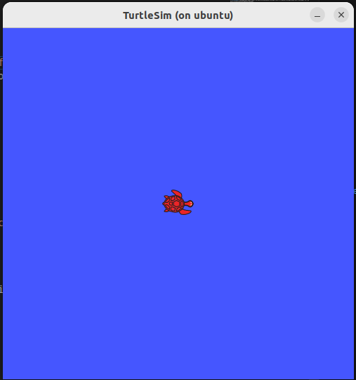

- Next, in Foxglove, add a "Teleop" panel and enter `/turtle1/cmd_vel` in the Topic box in the left sidebar.

    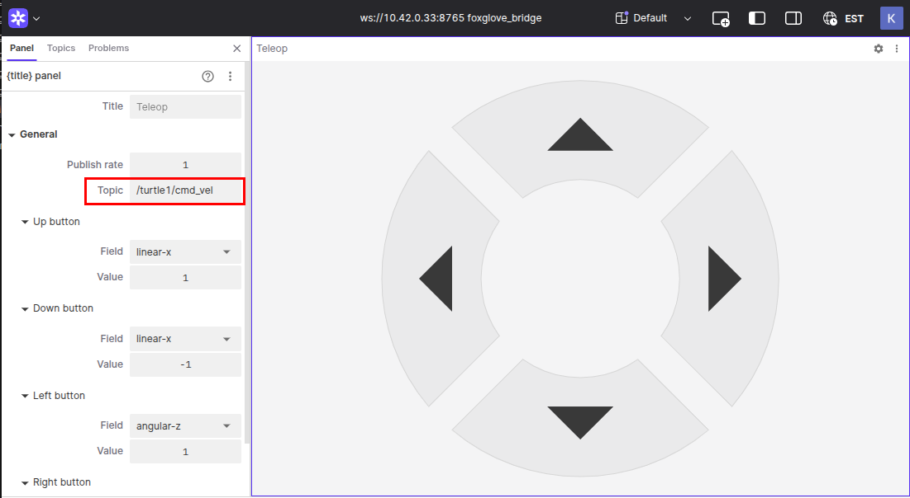

- Then, try to move the turtle with the arrow buttons in the panel.
- You can use this tool to move your differential wheel robot. Ensure your velocity topic is `geometry_msgs/Twist`.

**Happy Robot‑Making!**
